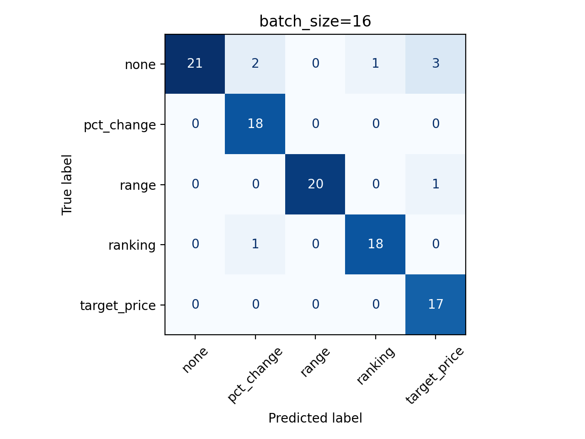

# Relatório de Performance e Custos

Os dados abaixo são referentes são referentes à avaliação do agente de parsing criado.

## Métricas de Qualidade

| Métrica | Batch size 1 | Batch size 16 |
| --- | --- | --- |
| Acurácia (`target_type`) | 77,45% | 91,18% |
| Precisão (`target_type`) | 85,30% | 91,55% |
| Recall (`target_type`) | 77,79% | 92,91% |
| F1 (`target_type`) | 78,88% | 91,40% |
| `timeframe` (exact match) | 87,25% | 88,24% |
| `extracted_value` (exact match) | 76,47% | 88,24% |
| Spearman (`bear_bull`) | 0,91 | 0,91 |
| Sucesso | 100% | 100,0% |

### Matrizes de Confusão (`target_type`)

### Observações

- As métricas de exact match de `timeframe` e `extracted_value` medem a quantidade de vezes em que **todos** os campos dessas extrações são iguais às referências. Por exemplo, para o `timeframe` contar como um acerto, é preciso que `explicit`, `start` e `end` estejam corretos ao mesmo tempo.
- O agente com batch_size=16 se saiu consideravelmente melhor do que o com batch_size=1, o que considero muito inesperado. O batch size diferente foi definido pelo prompt: quando ele é igual a 16, 16 posts são enviados para a avaliação do LLM. Com isso, em uma única resposta, ele precisa classificar corretamente 16 posts, ao invés de 1. Intuitivamente, é mais fácil classificar 1 post de cada vez, mas o contrário ocorreu.
- As métricas melhores do batch_size=16 talvez sejam por conta do thinking_budget maior concedido, de 1000 tokens de pensamento, contra 500 tokens para batch_size=1.
- Sucesso 100% quer dizer que o modelo não errou nenhuma vez o modelo (tipagem) de saída.

## Relatório de Custos

Valores de custo consideram o preço atual do modelo utilizado, o **gemini-2.5-flash** (USD 0,30/M tokens de entrada e USD 2,50/M tokens de saída).

| Métrica | Batch size 1 | Batch size 16 |
| --- | --- | --- |
| Lat. média (s) | 8,48 | 15,65 |
| Lat. p50 (s) | 3,61 | 15,38 |
| Lat. p95 (s) | 49,50 | 17,22 |
| Tokens entrada (média) | 4657,1 | 5785,7 |
| Tokens saída (média) | 495,2 | 2601,5 |
| Custo entrada média (USD) | 0,0014 | 0,0017 |
| Custo entrada p50 (USD) | 0,0014 | 0,0017 |
| Custo entrada p95 (USD) | 0,0014 | 0,0018 |
| Custo saída média (USD) | 0,0012 | 0,0065 |
| Custo saída p50 (USD) | 0,0013 | 0,0066 |
| Custo saída p95 (USD) | 0,0016 | 0,0068 |

### Observações

- A latência média alta pode ser explicada pelo rate limiting da API do Gemini. Eu estou usando uma chave gratuita, o que implica em limites maiores. Cada vez que eu era limitado, esperava 45 segundos para tentar de novo. Considere o p50 como uma métrica mais realista.
- Apesar de o batch_size=16 teoricamente ter 16x mais texto do que o batch_size=1, o tamanho da entrada foi só um pouco maior: 5785,7 vs 4650,5 tokens em média. Isso porque a maioria dos tokens é gasto com 'boilerplate' do pydantic-ai, além do system prompt grande.
