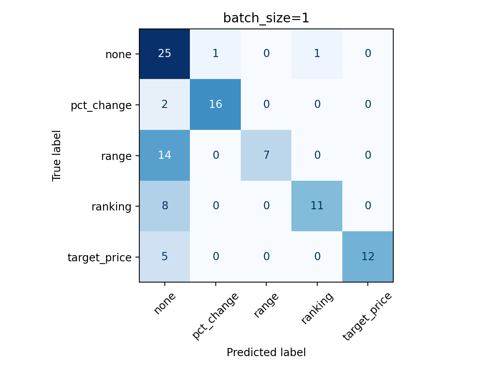

# Relatório de Performance e Custos

Os dados abaixo são referentes são referentes à avaliação do agente de parsing criado.

## Métricas de Qualidade

| Métrica | Batch size 1 | Batch size 16 |
| --- | --- | --- |
| Acurácia (`target_type`) | 69,61% | 92,16% |
| Precisão (`target_type`) | 86,42% | 92,28% |
| Recall (`target_type`) | 68,66% | 93,55% |
| F1 (`target_type`) | 71,38% | 92,32% |
| `timeframe` (exact match) | 87,25% | 90,20% |
| `extracted_value` (exact match) | 69,61% | 88,24% |
| Spearman (`bear_bull`) | 0,91 | 0,87 |
| Sucesso | 100% | 100% |

### Matrizes de Confusão (`target_type`)

### Observações

- As métricas de exact match de `timeframe` e `extracted_value` medem a quantidade de vezes em que **todos** os campos dessas extrações são iguais às referências. Por exemplo, para o `timeframe` contar como um acerto, é preciso que `explicit`, `start` e `end` estejam corretos ao mesmo tempo.
- Se o modelo errar a classe, não é possível acertar o `extracted_value`
- O agente com batch_size=16 se saiu consideravelmente melhor do que o com batch_size=1, o que considero inesperado, já que com um batch size maior, o agente deve classificar mais amostras ao mesmo tempo.
- O sucesso do agente com batch size maior talvez se deva ao maior thinking budget concedido: 4000 contra 500 do agente com batch size 1. Dei um thinking budget maior para o caso com mais inputs para compensar a entrada maior.
- Sucesso 100% quer dizer que o modelo não errou nenhuma vez o modelo (tipagem) de saída.

## Relatório de Custos

Valores de custo consideram o preço atual do modelo utilizado, o **gemini-2.5-flash** (USD 0,30/M tokens de entrada e USD 2,50/M tokens de saída).

| Métrica | Batch size 1 | Batch size 16 |
| --- | --- | --- |
| Lat. média (s) | 8,48 | 33,79 |
| Lat. p50 (s) | 3,61 | 31,99 |
| Lat. p95 (s) | 49,50 | 43,10 |
| Tokens entrada (média) | 4657,1 | 5784,7 |
| Tokens saída (média) | 495,2 | 5389,5 |
| Custo entrada média (USD) | 0,0014 | 0,0017 |
| Custo entrada p50 (USD) | 0,0014 | 0,0017 |
| Custo entrada p95 (USD) | 0,0014 | 0,0018 |
| Custo saída média (USD) | 0,0012 | 0,0135 |
| Custo saída p50 (USD) | 0,0013 | 0,0137 |
| Custo saída p95 (USD) | 0,0016 | 0,0140 |

### Observações

- A latência média alta pode ser explicada pelo rate limiting da API do Gemini. Eu estou usando uma chave gratuita, o que implica em limites maiores. Cada vez que eu era limitado, esperava 45 segundos para tentar de novo. Considere o p50 como uma métrica mais realista.
- As estatistícas para batch_size=16 talvez pudessem ser normalizadas pelo tamanho do batch, para encontrar um custo por entrada, e a comparação ser mais justa contra o batch_size=1.
